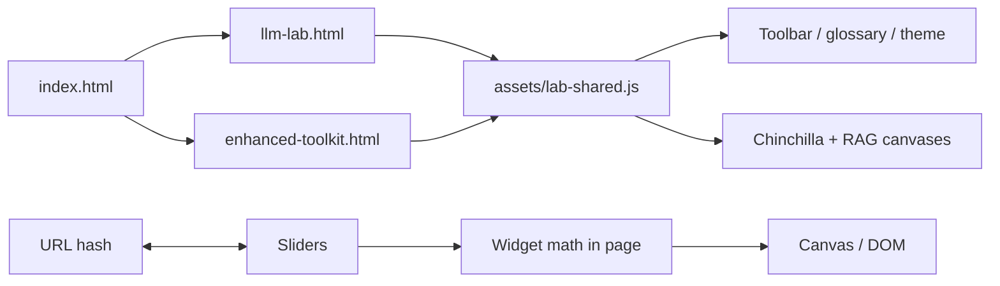
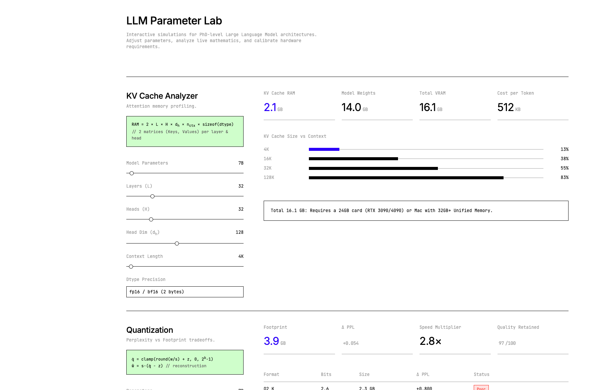
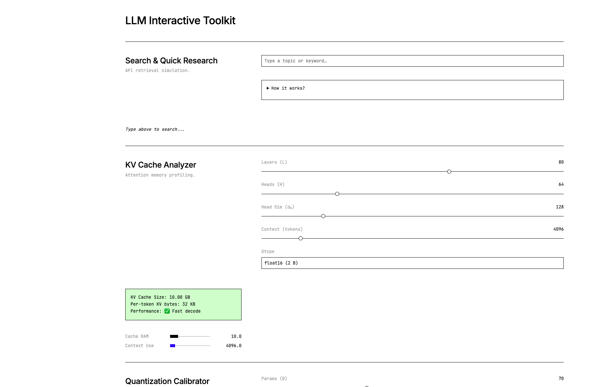

# LLM Parameter Lab

[](https://dmallick01.github.io/llm-parameter-lab/)
[](LICENSE)

**Interactive, zero-backend teaching dashboards** for LLM systems — KV cache memory, quantization, sampling, RLHF, RAG context budgets, and Chinchilla-style scaling laws. No server required; runs entirely in the browser.

**Current release:** v2.1 — hub, shared toolbar, presets, challenge mode, canvases, glossary, themes, shareable URLs, and cited references.

## Live demo

| Page | URL |
|------|-----|
| **Hub** (start here) | [dmallick01.github.io/llm-parameter-lab/](https://dmallick01.github.io/llm-parameter-lab/) |
| **Systems lab** | […/llm-lab.html](https://dmallick01.github.io/llm-parameter-lab/llm-lab.html) |
| **Enhanced toolkit** | […/enhanced-toolkit.html](https://dmallick01.github.io/llm-parameter-lab/enhanced-toolkit.html) |

GitHub Pages deploys the Vite `dist/` build on every push to `main` via [`.github/workflows/pages.yml`](.github/workflows/pages.yml). One-time setup: **Settings → Pages → Build and deployment → GitHub Actions**.

## What you can do

| Feature | Where |
|---------|--------|
| **7B / 70B / 405B presets** | KV cache widget (`llm-lab.html`) |
| **Challenge mode** | Predict KV RAM (GB), then reveal answer |
| **Chinchilla loss canvas** | Scaling laws widget |
| **RAG budget sankey** | RAG optimizer widget |
| **KaTeX formulas** | Under each widget |
| **Glossary** | Toolbar → searchable sidebar |
| **Light / dark theme** | Toolbar (saved in `localStorage`) |
| **Share config** | Toolbar → Copy link (`?widget=…` + `#slider=values`) |
| **EN / ES UI strings** | Toolbar language selector |
| **PNG export** | Per-widget canvas and metric panels |
| **Wikipedia search demo** | `enhanced-toolkit.html` (live REST API) |

### Deep links

Jump to a widget:

```text
llm-lab.html?widget=kv-cache
llm-lab.html?widget=quantization
llm-lab.html?widget=temperature
llm-lab.html?widget=rlhf
llm-lab.html?widget=rag
llm-lab.html?widget=scaling
```

### Suggested learning path

1. [KV cache](https://dmallick01.github.io/llm-parameter-lab/llm-lab.html?widget=kv-cache) — attention memory vs context length  
2. [Quantization](https://dmallick01.github.io/llm-parameter-lab/llm-lab.html?widget=quantization) — bits-per-weight vs perplexity  
3. [Sampling](https://dmallick01.github.io/llm-parameter-lab/llm-lab.html?widget=temperature) — temperature, top-p, top-k  
4. [RLHF](https://dmallick01.github.io/llm-parameter-lab/llm-lab.html?widget=rlhf) — reward vs KL penalty  
5. [RAG](https://dmallick01.github.io/llm-parameter-lab/llm-lab.html?widget=rag) — retrieval vs generation budget  
6. [Scaling](https://dmallick01.github.io/llm-parameter-lab/llm-lab.html?widget=scaling) — compute-optimal N and D  
7. [Search demo](https://dmallick01.github.io/llm-parameter-lab/enhanced-toolkit.html?widget=search) — retrieval before generation  

## Repository layout

```text
index.html              # Hub + learning path
llm-lab.html            # Full six-widget laboratory
enhanced-toolkit.html   # Alternate UI + Wikipedia search
assets/
  lab-shared.js         # Toolbar, i18n, viz, presets, challenge
  lab-shared.css
  i18n/en.json, es.json
docs/
  REFERENCES.md         # Papers behind each widget
  ROADMAP.md
  screenshots/
```

## Widgets & formulas

Educational approximations (not production training code):

| Widget | Formula (concept) |
|--------|-------------------|
| KV cache | \(\mathrm{RAM} \approx 2 \cdot L \cdot H \cdot d_h \cdot n_{\mathrm{ctx}} \cdot \mathrm{bytes}\) |
| Quantization | \(\hat{w}_i = s \cdot (\mathrm{clamp}(\mathrm{round}(w_i/s)+z, 0, 2^b-1)-z)\) |
| Sampling | \(P_T(x_i) \propto \exp(l_i/T)\) |
| RLHF | \(J(\theta) = \mathbb{E}[r] - \beta \cdot \mathrm{KL}(\pi_\theta \| \pi_{\mathrm{ref}})\) |
| RAG | Retrieved tokens + system + generation vs context window |
| Chinchilla | \(L(N,D) = A/N^\alpha + B/D^\beta + L_\infty\) |

## Local development

```bash
# Quickest: static server (source files)
python3 -m http.server 8080
# → http://localhost:8080/

# Vite dev server
npm install
npm run dev

# Production bundle (matches GitHub Pages)
npm run build
npm run preview   # serves dist/
```

## Architecture



## Screenshots

| KV cache & quantization | RLHF & scaling |
|-------------------------|----------------|
|  |  |

Regenerate after UI changes: run a local server, capture viewports, save under `docs/screenshots/`.

## Research references

Formulas and sliders are informed by published work (Attention, Chinchilla, RAG, InstructGPT/DPO, GPTQ, nucleus sampling, etc.). Full list:

- **[docs/REFERENCES.md](docs/REFERENCES.md)** — bibliography with arXiv links  
- **Page footer** — collapsible “Research references” on hub, lab, and toolkit  

## Tech stack

Vanilla JavaScript · HTML5 Canvas · KaTeX · CSS variables · optional [Vite](https://vitejs.dev/) multi-page build

## Roadmap

See [docs/ROADMAP.md](docs/ROADMAP.md) for shipped v2 items and future ideas.

## License

MIT — see [LICENSE](LICENSE).
