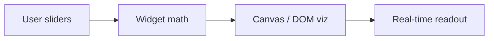

# LLM Parameter Lab

**One line:** Interactive, zero-backend dashboards for LLM systems — KV cache, quantization, sampling, RLHF, RAG budgets, and scaling laws.

## Live demo

Enable GitHub Pages on this repo (branch `main`, root `/`), then open:

`https://YOUR_USER.github.io/llm-parameter-lab/llm-lab.html`

Or locally:

```bash
python3 -m http.server 8080
# → http://localhost:8080/llm-lab.html
```

## Portals

| File | Topics |
|------|--------|
| [llm-lab.html](llm-lab.html) | KV cache RAM, quantization, logit decoders / sampling |
| [enhanced-toolkit.html](enhanced-toolkit.html) | RLHF objective, RAG context budget, Chinchilla scaling |
| [index.html](index.html) | Redirect hub |

## Flow



## Widgets & formulas

1. **KV cache** — $\mathrm{RAM} \approx 2 \cdot L \cdot H \cdot d_h \cdot n_{\mathrm{ctx}} \cdot \mathrm{bytes}$
2. **Quantization** — $\hat{w}_i = s \cdot (\mathrm{clamp}(\mathrm{round}(w_i/s)+z, 0, 2^b-1)-z)$
3. **Sampling** — $P_T(x_i) \propto \exp(l_i/T)$
4. **RLHF** — $J(\theta) = \mathbb{E}[r] - \beta \cdot \mathrm{KL}(\pi_\theta \| \pi_{\mathrm{ref}})$
5. **RAG budget** — context tokens vs. retrieval latency tradeoff
6. **Chinchilla** — $L(N,D) = A/N^\alpha + B/D^\beta + L_\infty$

## Screenshots

| KV cache & quantization | RLHF & scaling |
|-------------------------|----------------|
|  |  |

*(Regenerate with `python3 -m http.server` in repo root and capture the viewports.)*

## Tech stack

Vanilla JS · HTML5 Canvas · CSS variables · no build step

## License

MIT
