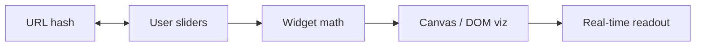

# LLM Parameter Lab

[](https://dmallick01.github.io/llm-parameter-lab/)
[](LICENSE)

**One line:** Interactive, zero-backend dashboards for LLM systems — KV cache, quantization, sampling, RLHF, RAG budgets, and scaling laws.

## Live demo

**[https://dmallick01.github.io/llm-parameter-lab/](https://dmallick01.github.io/llm-parameter-lab/)**

GitHub Pages deploys the Vite `dist/` build on every push to `main`. Enable Pages once: repo **Settings → Pages → Source: GitHub Actions**.

## Portals

| Page | Topics |
|------|--------|
| [index.html](index.html) | Hub, learning path, deep links |
| [llm-lab.html](llm-lab.html) | Full lab: KV, quant, sampling, RLHF, RAG, Chinchilla |
| [enhanced-toolkit.html](enhanced-toolkit.html) | Compact layout + Wikipedia search demo |

### Deep links

Open a widget directly:

- `llm-lab.html?widget=kv-cache`
- `llm-lab.html?widget=quantization`
- `llm-lab.html?widget=temperature`
- `llm-lab.html?widget=rlhf`
- `llm-lab.html?widget=rag`
- `llm-lab.html?widget=scaling`

Slider state is stored in the URL hash; use **Copy link** in the toolbar to share.

## Features

| Feature | Description |
|---------|-------------|
| KaTeX | Rendered formulas under each widget |
| Challenge mode | Guess KV cache RAM before revealing (lab page) |
| Presets | One-click 7B / 70B / 405B architectures |
| Theme | Light / dark toggle (persisted) |
| Glossary | Searchable sidebar (EN, ES UI strings) |
| Viz | Chinchilla loss canvas, RAG budget sankey |
| Export | PNG from canvases and metric panels |

## Local dev

```bash
# Static (no build)
python3 -m http.server 8080
# → http://localhost:8080/

# Vite dev server
npm install
npm run dev

# Production bundle
npm run build
npm run preview   # serves dist/
```

## Flow



## Widgets & formulas

1. **KV cache** — $\mathrm{RAM} \approx 2 \cdot L \cdot H \cdot d_h \cdot n_{\mathrm{ctx}} \cdot \mathrm{bytes}$
2. **Quantization** — $\hat{w}_i = s \cdot (\mathrm{clamp}(\mathrm{round}(w_i/s)+z, 0, 2^b-1)-z)$
3. **Sampling** — $P_T(x_i) \propto \exp(l_i/T)$
4. **RLHF** — $J(\theta) = \mathbb{E}[r] - \beta \cdot \mathrm{KL}(\pi_\theta \| \pi_{\mathrm{ref}})$
5. **RAG budget** — context tokens vs. retrieval latency tradeoff
6. **Chinchilla** — $L(N,D) = A/N^\alpha + B/D^\beta + L_\infty$

## Screenshots

| KV cache & quantization | RLHF & scaling |
|-------------------------|----------------|
|  |  |

## Tech stack

Vanilla JS · HTML5 Canvas · KaTeX · CSS variables · optional Vite bundle

## References

Widget math and copy are informed by published work (Chinchilla, RAG, RLHF, quantization, etc.). See [docs/REFERENCES.md](docs/REFERENCES.md) or the **Research references** section in each page footer.

## License

MIT
